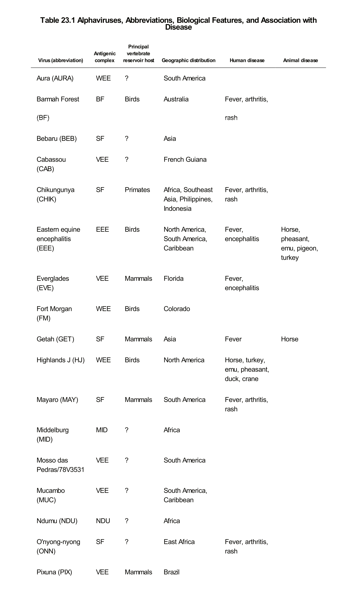
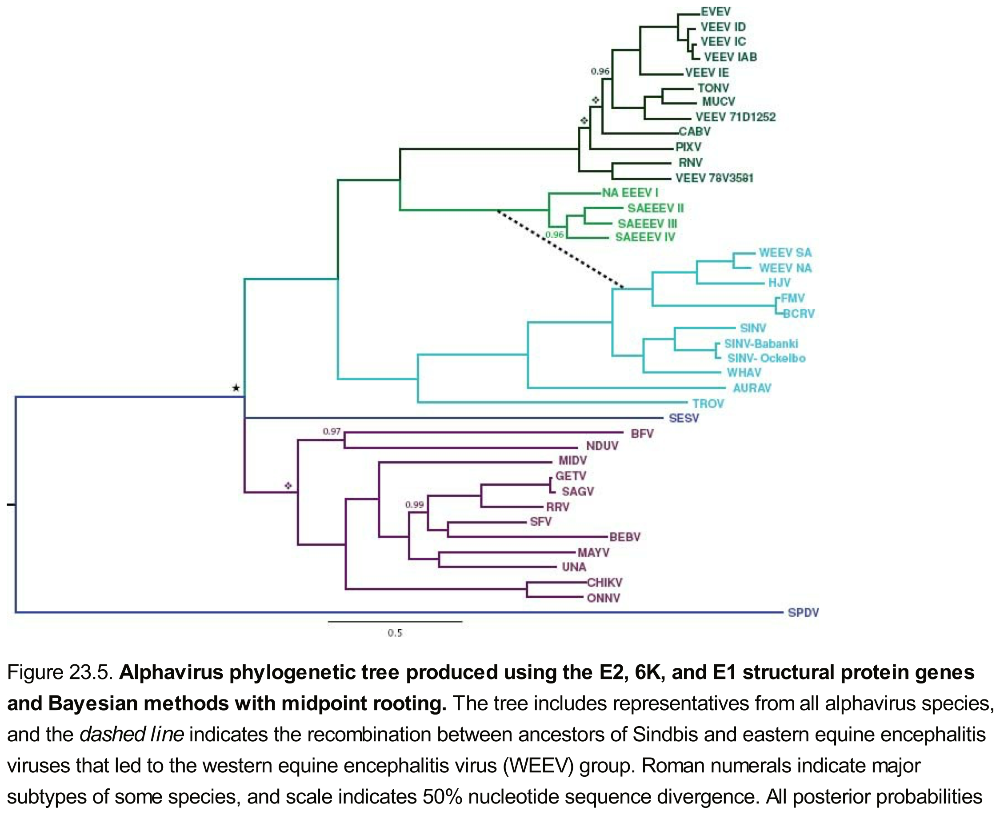
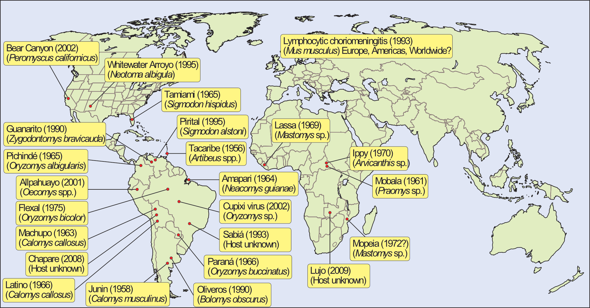
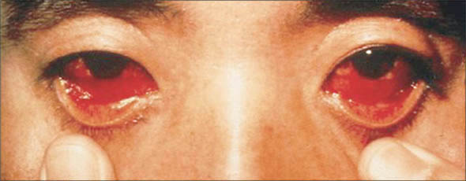

## Road Map

- Alphaviruses
    - History
        - New World (essentially western hemisphere)
        - Old World (essentially eastern hemisphere)
    - Basics of their biology
    - Clinical disease
    - Diagnosis and treatment
- Arenaviruses
- Bunyaviruses

# Alphaviruses

# History of alphavirus infections

## Alphaviruses have been around humans   far longer than other common zoonoses.

## The history of New World alphaviruses

- First certain reports of epidemic encephalitis occurred in Massachussets in 1831
    - That outbreak killed 75 horses

- Intermittent outbreaks continued throughout the Atlantic seaboard for the next 100 years

- First alphavirus cultured was Western equine encephalitis virus (WEEV) in 1930
    - Isolated from CNS of an affected horse in the San Joaquin Valley, CA
    
- Second isolated virus was Eastern equine encephalitis virus (EEEV) in Virginia in 1933

- Third isolated virus was Venezuelan equine encephalitis vires (VEEV) in 1936

- Outbreaks almost always occurred during the summer

## The history of Old World alphaviruses

- It is likely these have been around forever, but it is hard to distinguish it from more prevalent viruses like Dengue
    - For example, the first Old World alphavirus, Chikungunya (CHIKV), was not identified until much later

- First outbreaks occurred as summertime epidemics of polyarthritis in Australia and New Guinea in 1928

- CHIKV was isolated first in Tanzania in 1953 from the blood of humans with severe athritis

- In 1954, first classification distinguished Arthropod-borne viruses (Arboviruses) on the basis of Hemagglutinin Inhibition
    - Group A cross-reacting arboviruses included WEEV, EEEV, and VEEV
    - Group B cross-reacting arboviruses included St. Louis, Dengue, and Yellow fever
    - Group C were non-reactive
    - Eventually Group A became alphaviruses while Group B became Flaviviruses

## A lot of alphaviruses have been described!!

{height=650px}

# Basics of alphavirus biology

## Background biology of alphaviruses

- Enveloped (+)ssRNA viruses

- The definitive alphavirus cellular receptor is not known
    - MHC I serves as a sufficient, but not necessary receptor
    - Probably more than one exists
    
- In mice, virus primarily infects muscles and fibroblasts

- Induce substantial viremia to spread to other skeletal muscle

- Capable of recombination with other alphaviruses
    - In particular Sindbis-like and EEEV can recombine in nature
    - That is how WEEV was made

- In-vector incubation time requires 2-7 days for infectivity

- Vectors include many mosquito species and even other arthropods
    - _Ae. albopictus_ is common for CHIKV
    - _Culex_ is common for WEEV
    
## Evoution of alphaviruses

{height=650px}

## Epidemiology and Ecology of New World viruses

- Occurs virtually anywhere the vector is present
    - Gulf Coast
    - Atlantic Seaboard
    - Carribean
    - Great Lakes
    - Amazon Basin

- For children, 1 in 8 infections results in encephalitis

- For adults, 1 in 23 infections results in encephalitis

- CFR is high; usually between 30-50%
    - CFR is much lower for South American EEEV
    
- Epizootic cycle appears every 5 to 10 years and is associated with heavy rainfall and warmer water

- Approximately 8 human cases occur every year in the US

## Epidemiology and Ecology of Old World viruses

- These viruses are common and widespread in the Old World

- Separate rural and ubran cycles
    - Rural: disease is endemic with small of number cases every year
    - Urban: explosive outbreaks within large populations being infected in just a few weeks

- Most common viruses are CHIKV and Ross River virus

- CFR is ~1 in 1000 with most deaths in neonates

- May be maintained in mosquitoes via vertical transmission

# Clinical disease

## New World alphaviruses produce primarily encephalitis

## Old World alphaviruses produce polyarthralgia and rash

- CHIKV incubation time of 3-12 days

- Rash appears 4-8 days after initial illness

- Two most important things
    - Where were they recently?
    - Do their muscles hurt or do their joints hurt?

- If muscles primarily hurt, probably dengue

- If joints hurt and there is a rash
    - Central Africa: CHIKV, O'nyong-nyong (ONNV)
        - Can distinguish the two with ONNV having cervical lymphadenopathy
        - Cervical lymphadenopathy is common for ONNV
    - Other Africa: CHIKV
    - Central Australia: Ross River (RRV), Barmah Forest (BFV)
        - Can distinguish by symptom prominence: Rash = BFV, Arthritis = RRV
    - Other Oceania: Ross River
    - Anywhere (even Europe, Russia and West Asia): Sindbis (SNV)
        - If you think parvo B19, also think Sindbis
    
- Other symptoms include conjunctivitis (not as common for Dengue), headache, GI complaints

- Rash may cause a second rise in fever and be itchy

- Leukopenia is common

## Alphavirus diagnosis

- There are specific rtPCR primers for all alphaviruses and IgM serologies are very specific 

- New World viruses

- Old World viruses
    - CHIKV: PCR, IgM present for two months, 
    - ONNV: PCR in early illness, IgM present for two months
    - RRV: usually made by IgM serology which is positive for 1-2 years
    - SINV: IgM serology for 3-4 years
    - BFV: Serology?

## Treatment is supportive and symptomatic.  There are many vaccines under development as well as medications that are specific for the etiology of these arthralgias/myalgias.  Do your best!

# Arenaviruses

## Easiest to separate by ecology rather than clades

{width=2000px}

## Venezualen hemorrhagic fever

{width=500px}

{width=400px}

