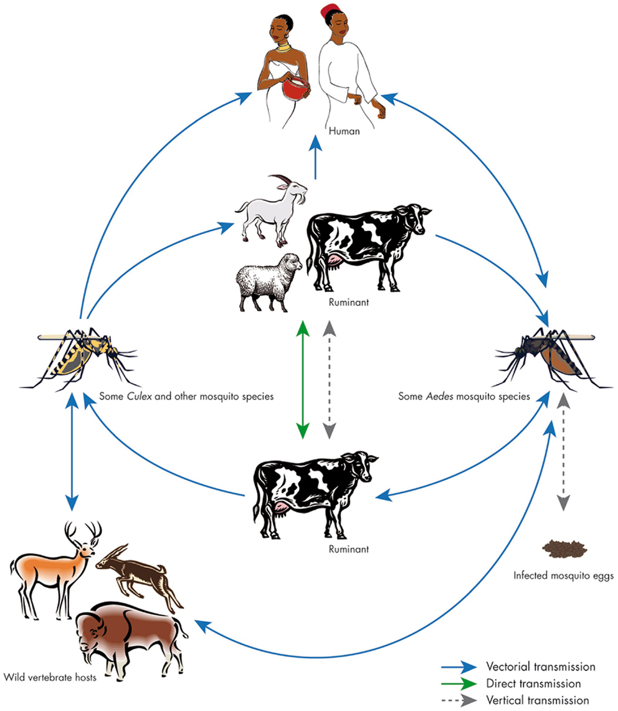

## Road Map

- Arboviruses
    - Serogroup A (Alphaviruses)
        - History
            - New World
            - Old World
        - Basics of their biology
        - Clinical disease
        - Diagnosis and treatment
    - Serogroup B (Flaviviruses - covered later)
    - Serogroup C (Bunyaviruses)
        - Brief history and categorization
        - Several Viruses
            - Geographic distribution
            - Relevant diseases
            - Diagnosis and treatment
- Other viruses that cause VNF
    - Arenaviruses
        - History
        - Virus geography
        - Biology and current investigation
        - Ecology and epidemiology
        - Clinical disease
        - Diagnosis and treatment
        - Prevention and control

# Alphaviruses

# History of alphavirus infections

## Alphaviruses have been around humans   far longer than other common zoonoses.

## The history of New World alphaviruses

- First certain reports of epidemic encephalitis occurred in Massachussets in 1831
    - That outbreak killed 75 horses

- Intermittent outbreaks continued throughout the Atlantic seaboard for the next 100 years

- First alphavirus cultured was Western equine encephalitis virus (WEEV) in 1930
    - Isolated from CNS of an affected horse in the San Joaquin Valley, CA
    
- Second isolated virus was Eastern equine encephalitis virus (EEEV) in Virginia in 1933

- Third isolated virus was Venezuelan equine encephalitis vires (VEEV) in 1936

- Outbreaks almost always occurred during the summer

## The history of Old World alphaviruses

- It is likely these have been around forever, but it is hard to distinguish it from more prevalent viruses like Dengue
    - For example, the first Old World alphavirus, Chikungunya (CHIKV), was not identified until much later

- First outbreaks occurred as summertime epidemics of polyarthritis in Australia and New Guinea in 1928

- CHIKV was isolated first in Tanzania in 1953 from the blood of humans with severe athritis

- In 1954, first classification distinguished Arthropod-borne viruses (Arboviruses) on the basis of Hemagglutinin Inhibition
    - Group A cross-reacting arboviruses included WEEV, EEEV, and VEEV
    - Group B cross-reacting arboviruses included St. Louis, Dengue, and Yellow fever
    - Group C were non-reactive
    - Eventually Group A became alphaviruses while Group B became Flaviviruses

## A lot of alphaviruses have been described!!

{height=650px}

# Basics of alphavirus biology

## Background biology of alphaviruses

- Enveloped (+)ssRNA viruses

- The definitive alphavirus cellular receptor is not known
    - MHC I serves as a sufficient, but not necessary receptor
    - Probably more than one exists
    
- In mice, virus primarily infects muscles and fibroblasts

- Induce substantial viremia to spread to other skeletal muscle

- Capable of recombination with other alphaviruses
    - In particular Sindbis-like and EEEV can recombine in nature
    - That is how WEEV was made

- In-vector incubation time requires 2-7 days for infectivity

- Vectors include many mosquito species and even other arthropods
    - _Ae. albopictus_ is common for CHIKV
    - _Culex_ is common for WEEV
    
## Evoution of alphaviruses

{height=650px}

## Epidemiology and Ecology of New World viruses

- Occurs virtually anywhere the vector is present
    - Gulf Coast
    - Atlantic Seaboard
    - Carribean
    - Great Lakes
    - Amazon Basin

- For children, 1 in 8 infections results in encephalitis

- For adults, 1 in 23 infections results in encephalitis

- CFR is high; usually between 30-50%
    - CFR is much lower for South American EEEV
    
- Epizootic cycle appears every 5 to 10 years and is associated with heavy rainfall and warmer water

- Approximately 8 human cases occur every year in the US

## Epidemiology and Ecology of Old World viruses

- These viruses are common and widespread in the Old World

- Separate rural and ubran cycles
    - Rural: disease is endemic with small of number cases every year
    - Urban: explosive outbreaks within large populations being infected in just a few weeks

- Most common viruses are CHIKV and Ross River virus

- CFR is ~1 in 1000 with most deaths in neonates

- May be maintained in mosquitoes via vertical transmission

# Clinical disease

## New World alphaviruses produce primarily encephalitis so we'll skip the rest

## Old World alphaviruses produce polyarthralgia and rash

- CHIKV incubation time of 3-12 days

- Rash appears 4-8 days after initial illness

- Two most important things
    - Where were they recently?
    - Do their muscles hurt or do their joints hurt?

- If muscles primarily hurt, probably dengue

- If joints hurt and there is a rash
    - Central Africa: CHIKV, O'nyong-nyong (ONNV)
        - Can distinguish the two with ONNV having cervical lymphadenopathy
        - Cervical lymphadenopathy is common for ONNV
    - Other Africa: CHIKV
    - Central Australia: Ross River (RRV), Barmah Forest (BFV)
        - Can distinguish by symptom prominence: Rash = BFV, Arthritis = RRV
    - Other Oceania: Ross River
    - Anywhere (even Europe, Russia and West Asia): Sindbis (SNV)
        - If you think parvo B19, also think Sindbis
    
- Other symptoms include conjunctivitis (not as common for Dengue), headache, GI complaints

- Rash may cause a second rise in fever and be itchy

- Leukopenia is common

## Alphavirus diagnosis

- There are specific rtPCR primers for all alphaviruses and IgM serologies are very specific 

- Old World viruses
    - CHIKV: PCR, IgM present for two months, 
    - ONNV: PCR in early illness, IgM present for two months
    - RRV: usually made by IgM serology which is positive for 1-2 years
    - SINV: IgM serology for 3-4 years
    - BFV: Serology?

## Treatment is supportive and symptomatic.  There are many vaccines under development as well as medications that are specific for the etiology of these arthralgias/myalgias.  Do your best!

# Bunyaviruses

# History and categorization

## History of Bunyaviruses

- First discovered in mosquitoes in 1943 during a yellow fever outbreak

- Essentially the largest class of RNA viruses
    - There are more than 350 categorized

- All of them except for Hantaviruses (i.e. probably the only ones we care about) are spread via arthropods
    - Can also be spread by blood contamination

## Categorization of Bunyaviruses

- (-)ssRNA virus
    - Segmented genome
    - Phylogenetically more in common with Arenaviruses and Ebola than other Arboviruses
    
- There are five genuses
    - Four cause human infections
    
- The diseases that I think we should have heard of:
    - Phlebovirus: Rift Valley Fever
    - Nariovirus: Crimean-Congo Hemorrhagic Fever (CCHF)
    - Hantavirus: Seoul virus, Sin nombre (Nameless) virus (Hanta Pulmonary Syndrome)
    - Orthobunyavirus: Probably none
    
# Several viruses in series

## Rift Valley Fever geography

{height=650px}

## Rift Valley Fever patients are not very sick

- Causes massive spontaneous abortion epidemics in livestock
    - Typically human outbreaks occur in the waning stage of livestock outbreaks
    - Transmitted by mosquitoes and direct blood transmission
    - Must ask about contacts!

- No documnated cases of human-to-human transmissions

- Incubation time of 2-6 days

- Typically: Fever, generalized weakness, back pain, dizziness. Most recover in a few days

- Around 10% get severe disease
    - Ocular form: Lesions anywhere on the eye within 1-3 weeks and resolved within 12
    - Encephalitis: About 1% of infections.
    - Hemorrhagic fever: Although this is around 1% of infections, death occurs in 50%.
        - Death occurs 3-6 days after hemorrhagic fever

- Diagnose with standard PCR, ELISA-Ag, ELISA-IgM

- No specific treatment and generally not necessary

## Rift Valley Fever life cycle

{height=650px}

## CCHF Geography

{height=650px}

## CCHF patients are very sick

- Spead by ixodes (hard) ticks
    - Also serve as reservoir
    - Transmission can also happen by direct blood contamination
  
- Typically: Sudden onset with headache, high fever, back pain, joint pain, stomach pain, vomiting (influenza-life syndrome)

- Commonly: Conjunctivitis, flushed face, palatal petechiae

- Occasionally: Jaundice, mood changes, sensory misperception

- Progresses to uncontrolled bleeding, bruising starting of day 4 with CFR = 10-50%

- Diagnosis: Same as Rift Valley Fever

- Treatment: Sensitive in vitro to Ribavirin. Supportive care in shock phase.

- Prevention: Agricultural workers need tick precautions
    - There is an inactivated mouse-brain derived vaccine that is only used in some sketchy parts of Europe

## (Hantaviruses) Hemorrhagic fever with renal syndrome geography

- Viruses (there are several that cause this) are found worldwide, but outbreaks previously occurred mostly in Asia

- We are in the midst of an outbreak of Seoul virus right now (it has really ended as of 03/2017)!
    - Currently 17 cases in 15 states
    - Started in rat breeders in the midwest 

- Transmission is identical HPS with aerosolized excreta

- Incubation time is 1-2 weeks usually but can take up to 8 weeks

- Sudden onset headaches, back and abdominal pain, fever, chills, nausea, and blurred vision

- In less than 5% progresses to hypotension, shock, and acute renal failure

- Diagnosis: Same as above

- Treatment: Supportive

# Arenaviruses

# History of Arenaviruses

## Need to know Lassa, Limited number of outbreaks for others

- First discovered was lymphocytic choriomeningitis virus in 1933
    - Found while studying St. Louis encephalitis

- Many subsequent case reports involved other Arenaviruses
    - Lassa Fever first infections 1969
        - Old World, mostly in the region of the 2014 Ebola outbreak
        - 300,000-500,000 cases annually, CFR Overall = 1%, CFR Severe Cases = 15%
    - Tacaribe, 1956, but doesn't infect humans
        - New World
    - Junin, 1958: CFR = 15-30%
        - New World, Argentina
    - Machupo, 1963: CFR = 25%
        - New World, Bolivia
    - Guanarito, 1989: CFR = 25%
        - New World, Venezuela
    - Sabia, 1990: CFR = 1/3
        - New World, Brazil
    - White Water Arroyo, 1996: CFR = 3/3
        - New World, New Mexico (same as Hantavirus)
    - Chapare, 2008
    - Lujo virus, 2008: CFR = 4/5
    
- Generally classified into two groups
    - Old World: LCMV-Lassa complex
    - New World: Tacaribe serocomplex

# Biology of arenaviruses

## Molecular biology of arenaviruses

- Enveloped, segmented (-)ssRNA virus

- Life cycle restricted to cellular cytoplasm

- Similar to Ebola, it encodes RNA-dependent RNA polymerase

- Use various cell surface receptors
    - Some use extracellular matrix proteins
    - Others including MACV and JUNV use the transferrin receptor

# Epidemiology and ecology 

## The reservoir for arenoviruses are rodents

{height=650px}

## Easiest to separate by geography rather than clades

{width=2000px}

## Lassa is probably the most important to know geographically

{height=650px}

# Clinical manifestations

## Other than LCMV, all of these viruses are similar

- Old World (Lassa Fever) and New World are similar except that neurologic symptoms, -penias, and bleeding are less common for Old World viruses

- Incubation time of 5-20 days

- Disease begins with fever, chills, malaise, anorexia, headache, and myalgias

- After several days, GI, neurologic and cardiac symptoms
    - Nausea/Vomiting/Constipation/Diarrhea/Epigastric pain
    - Dizziness/Photophobia/Retro-orbital pain
    - Low back pain

- During symptom onset they may experience swelling and bleeding gums, swelling and bleeding conjunctiva

- Patients often develop petechiae from thrombocytopenia

- Patients often experience bradycardia and orthostatic hypotension

- Should __never have__ cough, sore throat or congestion to distinguish from flu
    - There should be no pulmonary signs or symptoms
    
- During second week patients either begin to recover or begin to die

## Hemorhaggic fever signs

{width=500px}

{width=400px}

# Diagnosis and treatment

## Most important to know Lassa and Junin (AHF)

- Isolation in Vero cells

- ELISA for antigen
    - Availability of specific antibodies are limited
    - Lassa is best diagnosed with ELISA to IgM and antigen
        - Antigen disppears when IgM emerges so testing both is critical
        - Sensitivity is 90% at 48 hours
        - Antigen is in blood within a few days of infection
        - IgM peaks at 10-12 days
        - IgG is present after 3 weeks

- rtPCR

- Fatal cases can be diagnosed with immunohistochemistry with fixed tissue

- Neutralization assay is useful if specific convalescent serum is available

## Supportive treatment is helpful

- No steroids and no IFN-\(\gamma\)
    - Except maybe steroids for cerebral edema

- Only oral and IV therapies
    - SubQ and IM often cause hematomas
    
- For ANF, secondary pneumonias are common

- Platelets, activated factor VII, desmopressin, and transfusion have not been systemically evaluated

- Specific treatments
    - Ribavirin
        - Effective in vitro against most arenaviruses
            - This is not the case for Ebola
        - Articles from mid-1980s indicate efficacy against Lassa in vivo
            - Important for severe infections
    
    - Convalescent plasma
        - AHF: Reduces CFR from 15-30% to 1%
        - Lassa: Probably does not work
    
    - In pregnant patients, abortion improves survival of mother
    
    - High-throughput screens with pseudo-typed virus indentifies several in vitro viral entry inhibitors

# Prevention and control

## Do not play with rodents

- All arenaviruses are difficult to transmit between humans
    - It occassionally occurs by parenteral innoculation with Lassa
    - Lassa may have had airborne transmission in one Nigerian outbreak

- Rodent control is sufficient for Bolivian hemorrhagic fever
    - Won't work for Lassa because its reservoir is a common rat

- Vaccines
    - AHF live attentuated vaccine (Candid #1) developed in 1980's by Salk Institute
        - Licensed in late 2000s for use exclusively in Argentina
        - Very effective
        - Probably has some cross over to Bolivian hemorrhagic fever
    - Lassa
       - Lots of smoke, but no fire so far
       
# Take home: Could control or stop Arenaviruses There isn't enough money there to pursue it
